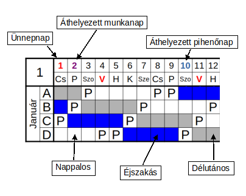
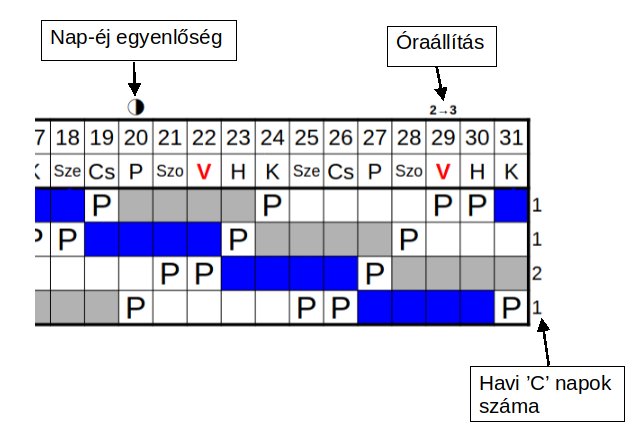
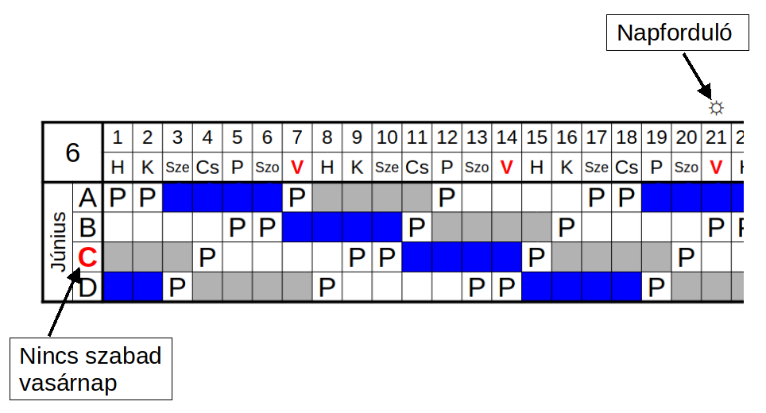

# Műszaknaptár
Automata műszaknaptár (LibreOffice 7.6.2.1-el készítve) Dunai Vasmű 8 órás folytonos munkarendhez.

- Használata:

    Az első munkafüzetben az évet kell átírni, és a "Munkaszüneti napok" munkafüzetben a mozgó ünnepeket, ill. a munkanap-áthelyezéseket kitölteni. A jelenlegi mozgó ünnepek 2015-2055 autumatikusan kitöltődnek.

- A munkanapok számításánál nem veszi figyelembe a munkanap-áthelyezéseket. Amíg hónapon belül vannak az áthelyezések nincs jelentősége.

Jelenleg két megoldás van:

## Makróval:
###### (Muazaknaptar_ta.ods)
- A dokumentum egy darab makrót tartalmaz, egy egyedi függvényt, aminek a kódja:

```vb
 Function MUSZAK8(datum as Date, muszak as Integer)
 rem 8h folytonos beosztás (datum: dátumérték; muszak:[1..4] /A=1 B=2 C=3 D=4/)

	Beoszt=Array("É","É","É","É","P","Du","Du","Du","Du","P","N","N","N","N","P","P")
	MUSZAK8 = Beoszt((datum - (muszak-1)*4) Mod 16)

 End Function
```

- A függvény visszaadja, hogy egy adott dátumhoz és műszakhoz éppen milyen beosztás tartozik.
Például:
'=MUSZAK8("2024-10-10";4)' kimenete: 'N' -Tehát 2024.10.10.-én a "D" azaz a 4-es műszak, NAPPALOS.

- Minden más alap függvényekkel és feltételes formázással van megvalósítva.

## Makró nélkül:
###### (Muszaknaptar_mn.ods)
- Ez alap függvényekkel valósítja meg ugyan azt: a 16-al való osztás maradékát megfelelteti, a műszak jelével:
```calc
=KÖZÉP("ÉÉÉÉPDDDDPNNNNPP";MARADÉK(INDIREKT("r[-2]";0);16)+1;1)
```
- a másik műszak, csak el van tolva a másikhoz képest 4 nappal:
```calc
=KÖZÉP("ÉÉÉÉPDDDDPNNNNPP";MARADÉK(INDIREKT("r[-3]";0)-4;16)+1;1)
```

## Jelmagyarázat:



